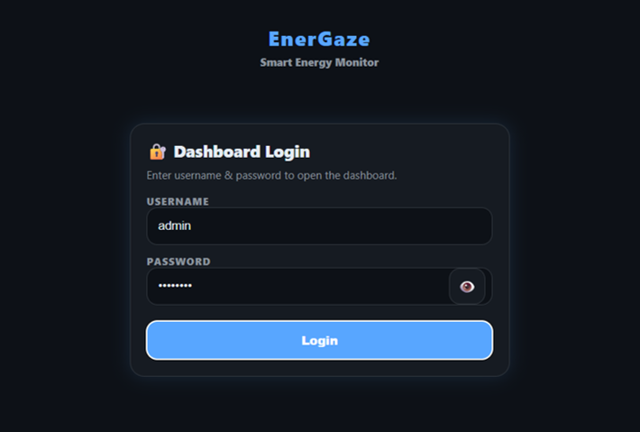
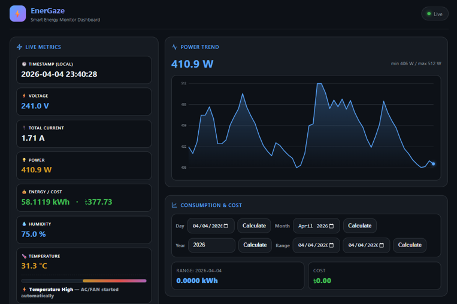
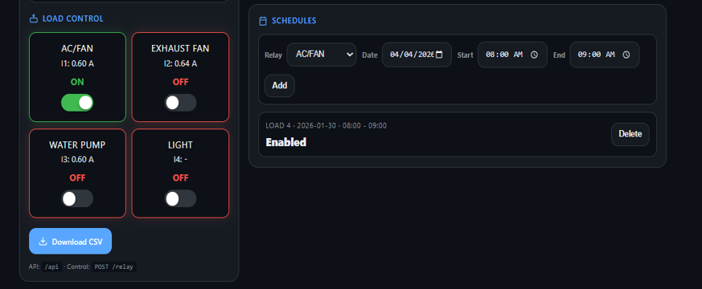
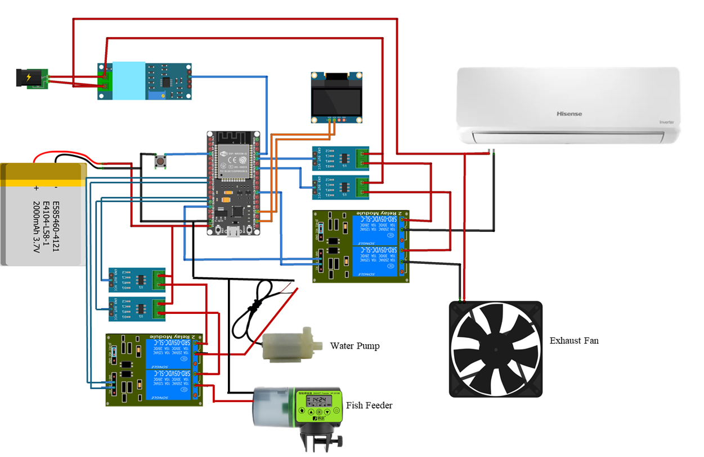
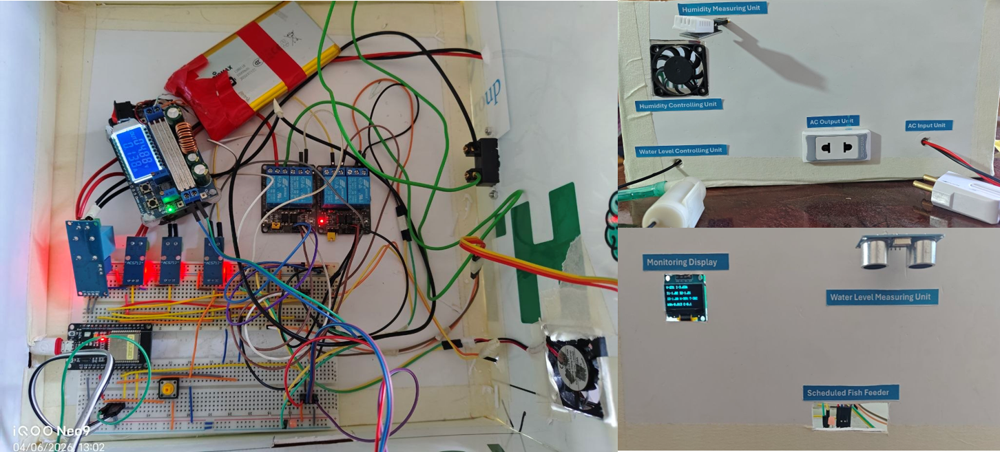

# EnerGaze (ESP32 Smart Energy Monitor)

An ESP32-based energy monitoring + automation project that measures AC voltage/current, estimates real-time power and energy usage, logs data to on-board flash (SPIFFS) as CSV, and exposes control/monitoring through:

- A **local web dashboard** (with login)
- The **Blynk IoT mobile app**
- A **0.96" SSD1306 OLED**

It also supports **scheduling** and **basic automation** (temperature, humidity, ultrasonic distance) plus **over-current auto trip** for safety.

## Pictures

### Secure Authentication Gateway



### Live Analytics & Data Monitoring



### Smart Load Management & Scheduling



### Circuit Diagram



### Hardware Implementation




## Features

- **Live electrical metrics**
  - $V_{rms}$ from ZMPT101B
  - Per-load current (3 channels) from ACS712 (smoothed)
  - Total current, estimated real power ($P \approx V_{rms} \cdot I_{total}$)
  - Accumulated **kWh** and **cost** (configurable tariff)
- **Local web dashboard** (ESP32 WebServer)
  - Login page + session cookie
  - Live JSON API for the UI
  - Relay control (4 relays)
  - Consumption/cost summary for day/month/year/range + future prediction using last-14-day average (when history exists)
  - Schedule management (stored in SPIFFS)
  - CSV download (`/data.csv`)
- **Blynk IoT integration**
  - Pushes voltage/current/power/kWh/cost/humidity/temperature
  - Allows remote relay control (virtual pins)
- **OLED display**
  - Shows voltage, currents, kWh, cost, and DHT readings
- **Automation + protection**
  - Overcurrent auto-off (per load) with cooldown before re-enabling
  - Auto control:
    - Relay 1 by temperature threshold
    - Relay 2 by humidity threshold
    - Relay 3 by ultrasonic distance (with manual override)
  - Schedules can force a relay ON/OFF during a specified window for a given date
- **Data logging**
  - Writes a CSV row every 60 seconds to SPIFFS (`/data.csv`)
  - Short press reset: clears kWh/cost only
  - Long press reset: clears counters **and deletes** `/data.csv`

---

## Required Elements

### Hardware

- ESP32 development board (tested with generic **ESP32 DevKit** / `esp32:esp32:esp32`)
- 0.96" I2C OLED (SSD1306, 128×64, common address `0x3C`)
- Current sensors (analog output)
  - 3× ACS712 modules (sketch is written for **3 current channels**) 
- AC voltage sensor module
  - 1× ZMPT101B analog voltage sensor
- Relay module (active LOW)
  - 4-channel relay recommended (sketch controls **Relay 1..4**)
- DHT sensor
  - DHT22 is configured (`DHTTYPE DHT22`)
- Ultrasonic sensor
  - HC-SR04 compatible (TRIG/ECHO)
- 1× push button (reset)
- Resistors / level shifting as needed
  - **HC-SR04 ECHO is 5V**: use a voltage divider or level shifter to 3.3V for ESP32

### Safety (important)

This project can involve **mains AC measurement and relay switching**.

- Use proper isolation, fuse protection, enclosures, and safe wiring practices.
- Never touch live circuits while powered.
- If you’re not experienced with mains wiring, get help from someone who is.

---

## Pinout (from the sketch)

All pin definitions are in `EnerGaze.ino` under `// ==================== PINS ====================`.

| Function | Pin | Notes |
|---|---:|---|
| ACS712 Load 1 | GPIO34 | ADC1 (safe with WiFi) |
| ACS712 Load 2 | GPIO32 | ADC1 |
| ACS712 Load 3 | GPIO33 | ADC1 |
| ZMPT101B (Voltage) | GPIO35 | ADC1 |
| Relay 1 | GPIO26 | **Active LOW** (LOW=ON) |
| Relay 2 | GPIO27 | **Active LOW** |
| Relay 3 | GPIO18 | **Active LOW** |
| Relay 4 | GPIO23 | **Active LOW** |
| Reset button | GPIO4 | Uses `INPUT_PULLUP` (button to GND) |
| Ultrasonic TRIG | GPIO19 | |
| Ultrasonic ECHO | GPIO13 | **Must be 3.3V max** |
| DHT22 DATA | GPIO25 | Add ~10k pull-up to 3.3V |
| OLED I2C | SDA=GPIO21, SCL=GPIO22 | Default ESP32 I2C pins |

---

## Software Requirements

- Arduino IDE 2.x **or** `arduino-cli`
- ESP32 Arduino core (`esp32:esp32`)
- Libraries (Arduino Library Manager):
  - **Blynk** (`BlynkSimpleEsp32.h`)
  - **Adafruit GFX Library**
  - **Adafruit SSD1306**
  - **DHT sensor library** (and `Adafruit Unified Sensor` if your DHT lib pulls it in)

Built-in/ESP32 core libs used: `WiFi`, `Wire`, `EEPROM`, `SPIFFS`, `WebServer`, `WiFiUdp`, `NTPClient`.

---

## Setup / Configuration

### 1) Configure credentials & constants

Edit the top of `EnerGaze.ino`:

- `BLYNK_TEMPLATE_ID`, `BLYNK_TEMPLATE_NAME`, `BLYNK_AUTH_TOKEN`
- WiFi:
  - `const char ssid[] = "...";`
  - `const char pass[] = "...";`
- Web dashboard login (change before sharing on LAN/Internet):
  - `WEB_USERNAME`
  - `WEB_PASSWORD`
- Tariff and thresholds:
  - `RATE_PER_KWH`
  - `MAX_CURRENT`
  - `HUMIDITY_AUTO_ON_THRESHOLD_PCT`
  - `TEMP_AUTO_ON_THRESHOLD_C`
- Time zone:
  - `TIMEZONE_OFFSET_SECONDS`

### 2) Build & upload (Arduino IDE)

1. Open the project folder in Arduino IDE (or open `EnerGaze.ino`).
2. Boards Manager → install **ESP32 by Espressif Systems**.
3. Tools:
   - Board: an ESP32 Dev module (matching your board)
   - Port: your connected COM port
4. Install libraries (Library Manager): Blynk, Adafruit SSD1306, Adafruit GFX, DHT.
5. Upload.
6. Open Serial Monitor at **115200**.

### 3) Build (arduino-cli)

This workspace already contains VS Code tasks for building with `arduino-cli`.

Typical command (example):

```bash
arduino-cli compile --fqbn esp32:esp32:esp32 .
```

> Uploading requires a board port; once you know the port, you can use `arduino-cli upload`.

---

## Using the Local Web Dashboard

After WiFi connects, Serial output prints URLs like:

- `http://<device-ip>/` (dashboard)
- `http://<device-ip>/data.csv` (CSV download)

### Default login

- Username: `admin`
- Password: `admin123`

Change these in `EnerGaze.ino` before deploying.

### HTTP endpoints (LAN)

- `GET /` Dashboard UI (requires login)
- `GET /login`, `POST /login`, `GET /logout`
- `GET /api` Live JSON telemetry (requires login)
- `GET /summary` Consumption/cost calculations (requires login)
- `POST /relay` Relay control (requires login)
- `GET /schedules` List schedules (requires login)
- `POST /schedules/add` Add schedule (requires login)
- `POST /schedules/delete` Delete schedule (requires login)
- `GET /data.csv` Download the logged CSV file (requires login)

Relay control example:

```text
POST /relay
Content-Type: application/x-www-form-urlencoded

relay=1&action=toggle
```

---

## Blynk Virtual Pin Mapping

Controls:

- `V5`  → Relay 1 (AC/FAN)
- `V6`  → Relay 2 (Exhaust fan)
- `V10` → Relay 3 (Water pump)
- `V12` → Relay 4 (Light)

Telemetry pushed to Blynk:

- `V0`  Vrms (V)
- `V1`  I1 (A)
- `V7`  I2 (A)
- `V11` I3 (A)
- `V2`  Power (W)
- `V3`  kWh
- `V4`  Cost
- `V8`  Humidity (%)
- `V9`  Temperature (°C)

---

## Data Logging (CSV)

- Stored in SPIFFS as `/data.csv`
- Written every **60 seconds**
- Header (current version):

```csv
Timestamp,Epoch,Vrms_V,I1_A,I2_A,I3_A,TotalI_A,Power_W,kWh,Cost,Humidity_pct,Temp_C,Relay1,Relay2,Relay3,Relay4
```

Reset button on GPIO4:

- Short press: reset `kWh` and `cost` (keeps CSV)
- Long press (≥ 3s): reset counters **and delete** `/data.csv`

---

## Calibration Notes

If your readings look wrong, these constants are the usual ones to tune:

- ACS712 sensitivity: `ACS712_SENSITIVITY` (depends on 5A/20A/30A model)
- Voltage calibration: `V_CAL` for ZMPT101B
- Overcurrent threshold: `MAX_CURRENT`

The sketch calibrates ACS712 offsets during boot. Keep relays OFF / loads disconnected during startup for best results.

---

## Troubleshooting

- **No web dashboard**: ensure WiFi credentials are correct; check Serial Monitor for IP.
- **OLED not working**: verify I2C wiring and address (`0x3C`); SDA/SCL pins.
- **Wrong current/voltage**: recalibrate (`ACS712_SENSITIVITY`, `V_CAL`), ensure proper sensor supply and grounding.
- **HC-SR04 unstable**: ensure ECHO level shifting to 3.3V, stable 5V supply, and common GND.

---

## License

Add a license if you plan to publish this project.
